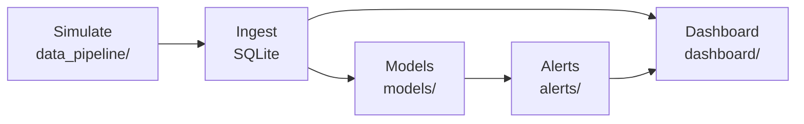

# Smart Kitchen

Real-time monitoring of kitchen appliances. Three simulated devices (refrigerator, oven, microwave)
report temperature, CO, CO₂ and power draw. The backend stores the readings, detects anomalies, predicts
upcoming temperatures and raises alerts, which are shown in a Streamlit dashboard, a REST API and the
[Flutter app](../flutter_smart_kitchen).

## Pipeline



| Stage | Main files | Notes |
|---|---|---|
| Simulation | `data_pipeline/data_simulation.py` (batch CSV), `data_mqtt.py`, `data_iot.py`, `data_demo.py`, `data_kafka.py` (streaming) | Gaussian readings around a per-device operating point; one publisher thread per device |
| Ingestion | `data_pipeline/data_ingestion*.py`, `src/data_ingestion/server.py` (FastAPI endpoint) | Subscribes to the broker (or loads the CSVs) and writes to the `sensor_data` table in SQLite |
| Anomaly detection | `models/anomaly_detection.py` | Isolation Forest (3% contamination) on standardized temperature, CO, CO₂ and power; results in `models/results/` |
| Temperature forecast | `models/predictive_maintenance.py` | Random Forest regressor predicting each appliance's temperature 5 samples ahead from rolling mean/std features; saved to `models/saved_models/` |
| Alerts | `alerts/alert_system*.py` | Batch mode combines the anomaly rate and the forecast; streaming modes apply threshold rules (e.g. oven above 200 °C, CO above 50 ppm) and store alerts in SQLite |
| Dashboard | `dashboard/dashboard_app*.py` | Streamlit; the `_demo` version adds login (streamlit-authenticator) and tenant filtering |
| REST API | `main_app.py` | Flask + JWT: `POST /login`, `GET /devices`, `/live-data/<device>`, `/predictions`, `/alerts`, `/health` |
| Integrations | `integrations.py` | Stubs for forwarding data to Home Assistant (MQTT discovery) and Google Home (SDM API) |

## Entry points

The project grew in stages, and each `main_*.py` wires the same pipeline to a different transport:

| Entry point | Transport | Modules it starts |
|---|---|---|
| `main.py` | none (batch) | `data_simulation` → `data_ingestion` → `alert_system` → `dashboard_app` |
| `main_mqtt.py` | local Mosquitto broker | `data_mqtt` → `data_ingestion_mqtt` → `alert_system_mqtt` (dashboard: `dashboard_app_mqtt.py`) |
| `main_iot.py` | AWS IoT Core (MQTT over TLS) | `data_iot` → `data_ingestion_iot` → `alert_system_iot` (dashboard: `dashboard_app_iot.py`) |
| `main_demo.py` | AWS IoT Core, multi-tenant | `data_demo` → `data_ingestion_demo` → `alert_system_demo` (dashboard: `dashboard_app_demo.py`) |
| `main_app.py` | as `main_demo.py`, plus the REST API on port 8080 | used by `docker-compose.yml` |
| Kafka scripts | Kafka (`data_pipeline/docker-compose-kafka.yml`) | `data_kafka.py` (producer) and `data_ingestion_kafka.py` (consumer), run individually |

## Running it

### 1. Batch pipeline (no broker needed)

```bash
pip install -r requirements.txt
python main.py            # simulate, store, check alerts, then open the dashboard on :8501
```

To regenerate the data and retrain the models (the scripts resolve paths relative to the folder they are
run from):

```bash
cd data_pipeline && python data_simulation.py && python data_ingestion.py && cd ..   # -> data_pipeline/smart_kitchen.db
cd models && python anomaly_detection.py && python predictive_maintenance.py && cd .. # -> models/results/, models/saved_models/
python alerts/alert_system.py                                                         # uses both outputs
```

### 2. Streaming with a local MQTT broker

```bash
docker run -d -p 1883:1883 -v "$PWD/config:/mosquitto/config" eclipse-mosquitto:2.0
python main_mqtt.py                                  # simulator, ingestion and alerts
streamlit run dashboard/dashboard_app_mqtt.py        # in a second terminal
```

### 3. AWS IoT Core + Docker Compose (EC2)

1. Create an IoT *thing* in AWS IoT Core and download its certificate and private key, plus the Amazon
   root CA, into `certs/` (git-ignored): `AmazonRootCA1.pem`, `device.pem.crt`, `device.pem.key`.
2. Create a `.env` file next to `docker-compose.yml`:

   ```ini
   MQTT_ENDPOINT=<your-endpoint>-ats.iot.<region>.amazonaws.com
   MQTT_PORT=8883
   TENANT_ID=demo
   CREDENTIALS={"usernames":{"demo":{"name":"Demo User","password":"<choose-a-password>"}}}
   ```

   Also replace the placeholder `JWT_SECRET` in `docker-compose.yml` with your own value.
3. Create the database file and start the stack:

   ```bash
   touch kitchen.db          # bind-mounted into the containers
   docker compose up --build
   ```

   Nginx serves the dashboard on `http://<host>/` and the API under `http://<host>/api/`.

## Data model

Table `sensor_data` in SQLite: `timestamp`, `device`, `temperature_C`, `CO_ppm`, `CO2_ppm`, `power_W`,
`tenant_id`. Alerts go to the `alerts` table (`timestamp`, `device`, `message`, `severity`, `tenant_id`).

## Notes

* The `.db`, CSV and `.pkl` files in this folder are example outputs of the pipeline and are recreated
  when you run it.
* The ML steps that `main_app.py` and `main_demo.py` call (`src/anomaly_detection`,
  `src/predictive_maintenance`) are placeholders. Use the scripts in `models/` for the working models.
